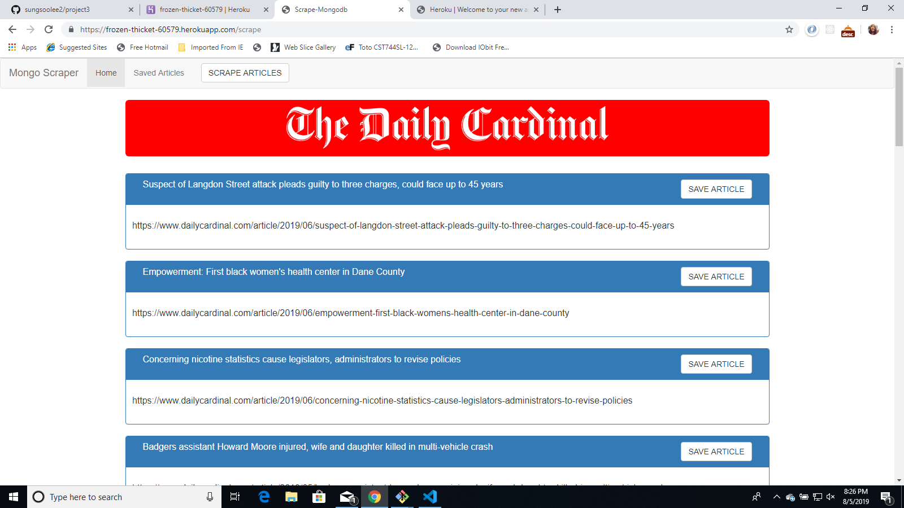
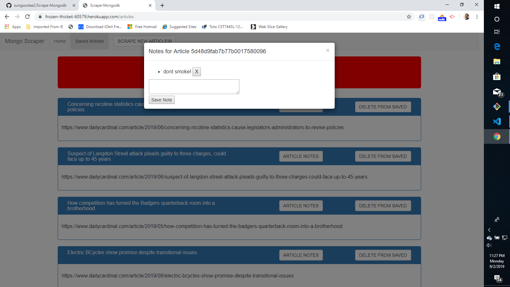

# Scrape-MongoDB

This project uses request scraping npm package to scrape the headlines from the [Daily Cardinal Newspaper](https://www.dailycardinal.com/).
It takes the Headline and Link to the article and displays it to the DOM when the scrape articles button is clicked.
The user can save articles and notes for that article to MongoDB database. The user can also delete or add notes and articles to the database.

[Heroku Link :](https://frozen-thicket-60579.herokuapp.com/)

## Screen Shots

Scrape Articles

Saved Articles & Notes

## Technologies used
- [express-handlebars NPM](https://www.npmjs.com/package/express-handlebars)
- [Express.js Framework](https://expressjs.com/)
- [Handlebars](https://handlebarsjs.com/)
- [Request-Promise NPM](https://www.npmjs.com/package/request-promise)
- [Mongoose](http://mongoosejs.com/docs/api.html)

